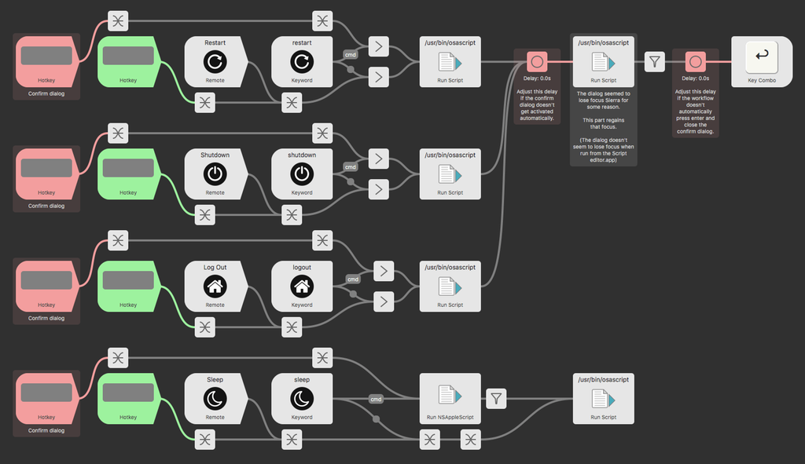

# System Commands.alfredworkflow

Alfred doesn’t honor the [“**Reopen windows when logging back in**”](readme-images/macosx-restart-dialog.png) option. This workflow gets around it.

By default, this workflow executes the “commands” by automatically going through the dialogs but if you hold down `Cmd`, you get to manually cancel or accept the confirmation dialog.

You can use that confirmation dialog to change the “**Reopen windows when logging back in**” option. `Space` toggles it.

> The workflow is made for Alfred 3.

## Before using the script

**You’ll want to disable the equivalent commands that come with Alfred:**
`Alfred Preferences > Features > System`

## Default Keywords
* Shutdown
* Restart
* Logout
* Sleep

## Hotkey info

There are 2 different hotkeytriggers. Red hotkey triggers give you the confirmation dialog while the green hotkey triggers don’t.
